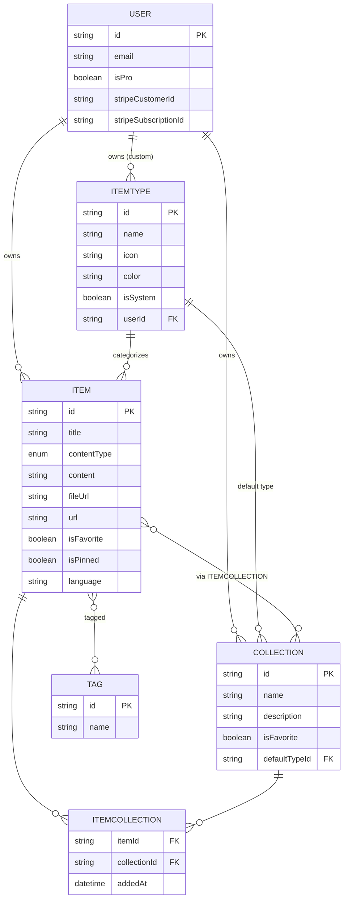
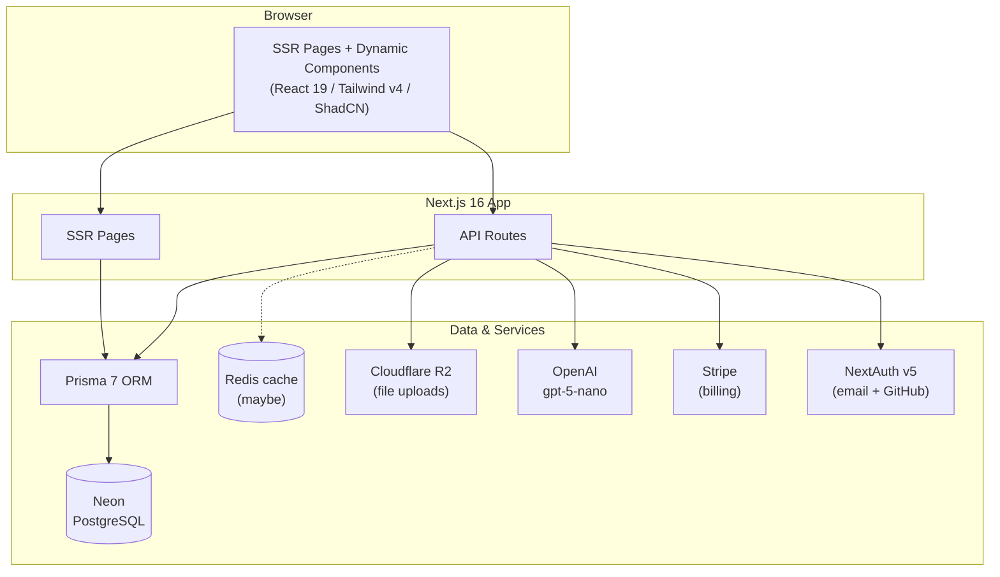

# DevStash — Project Overview

> **One fast, searchable, AI-enhanced hub for all developer knowledge and resources.**

DevStash pulls together the scattered essentials developers rely on every day — snippets, prompts, commands, notes, links, and files — into a single searchable workspace. Instead of hunting across VS Code, Notion, chat histories, bookmarks, gists, and `.txt` files, developers stash everything in one place and grab it in seconds.

---

## Table of Contents

1. [Problem](#1-problem)
2. [Target Users](#2-target-users)
3. [Features](#3-features)
4. [Data Model](#4-data-model)
5. [Architecture](#5-architecture)
6. [Tech Stack](#6-tech-stack)
7. [Monetization](#7-monetization)
8. [UI / UX](#8-ui--ux)
9. [Open Questions & Notes](#9-open-questions--notes)

---

## 1. Problem

Developers keep their essentials scattered across too many places:

| Resource | Usually lives in |
| --- | --- |
| Code snippets | VS Code, Notion |
| AI prompts | Chat histories |
| Context files | Buried in project folders |
| Useful links | Browser bookmarks |
| Docs | Random folders |
| Commands | `.txt` files, bash history |
| Project templates | GitHub gists |

This fragmentation causes **context switching**, **lost knowledge**, and **inconsistent workflows**. DevStash solves it with a single, fast, searchable, AI-enhanced hub.

---

## 2. Target Users

- **Everyday Developer** — needs a fast way to grab snippets, prompts, commands, and links.
- **AI-first Developer** — saves prompts, contexts, workflows, and system messages.
- **Content Creator / Educator** — stores code blocks, explanations, and course notes.
- **Full-stack Builder** — collects patterns, boilerplates, and API examples.

---

## 3. Features

### A. Items & Item Types

Every stashed thing is an **Item**. Items have a **type**. Users can eventually create custom types, but we ship with these fixed **system types** (not editable):

| Type | Content kind | Route | Color | Icon |
| --- | --- | --- | --- | --- |
| Snippet | text | `/items/snippets` | `#3b82f6` (blue) | `Code` |
| Prompt | text | `/items/prompts` | `#8b5cf6` (purple) | `Sparkles` |
| Note | text | `/items/notes` | `#fde047` (yellow) | `StickyNote` |
| Command | text | `/items/commands` | `#f97316` (orange) | `Terminal` |
| Link | url | `/items/links` | `#10b981` (emerald) | `Link` |
| File _(Pro)_ | file | `/items/files` | `#6b7280` (gray) | `File` |
| Image _(Pro)_ | file | `/items/images` | `#ec4899` (pink) | `Image` |

> Icons reference the [lucide-react](https://lucide.dev/) set used by ShadCN.

**Content kinds** break down into three storage shapes:

- **text** — snippet, prompt, note, command (stored in `content`)
- **url** — link (stored in `url`)
- **file** — file, image (stored in R2, referenced by `fileUrl`)

Items should be **quick to create and open** inside a drawer.

### B. Collections

Users create **Collections** that can hold items of any type. An item can belong to **multiple collections** (e.g. a React snippet could live in both *React Patterns* and *Interview Prep*).

Examples:

- **React Patterns** — snippets, notes
- **Context Files** — files
- **Python Snippets** — snippets

### C. Search

Powerful search across **content**, **tags**, **titles**, and **types**.

### D. Authentication

- Email / password
- GitHub OAuth sign-in

### E. Other Features

- Favorite collections and items
- Pin items to top
- Recently used
- Import code from a file
- Markdown editor for text types
- File upload for file types (file / image)
- Export data in multiple formats
- Dark mode (default for devs), light mode optional
- Add / remove items to / from multiple collections
- View which collections an item belongs to

### F. AI Features (Pro only)

- AI auto-tag suggestions
- AI summaries
- "Explain this code"
- Prompt optimizer

---

## 4. Data Model

> Rough mockup — **not set in stone**. Extended slightly from the original notes for coherence (see notes below the schema).

### Entity Relationships



### Prisma Schema

```prisma
// schema.prisma

generator client {
  provider = "prisma-client-js"
}

datasource db {
  provider = "postgresql"
  url      = env("DATABASE_URL")
}

enum ContentType {
  TEXT
  FILE
  URL
}

// Extends the NextAuth User. NextAuth-managed fields
// (name, email, emailVerified, image) + Account/Session
// models are omitted here for brevity.
model User {
  id                   String     @id @default(cuid())
  name                 String?
  email                String?    @unique
  emailVerified        DateTime?
  image                String?

  // Billing
  isPro                Boolean    @default(false)
  stripeCustomerId     String?    @unique
  stripeSubscriptionId String?    @unique

  // Relations
  items                Item[]
  collections          Collection[]
  itemTypes            ItemType[] // custom types only

  createdAt            DateTime   @default(now())
  updatedAt            DateTime   @updatedAt
}

model Item {
  id          String      @id @default(cuid())
  title       String
  contentType ContentType @default(TEXT)

  // text types
  content     String?     // null when file-based
  language    String?     // optional, for code

  // file types (Pro)
  fileUrl     String?     // Cloudflare R2 URL
  fileName    String?     // original filename
  fileSize    Int?        // bytes

  // link type
  url         String?

  description String?
  isFavorite  Boolean     @default(false)
  isPinned    Boolean     @default(false)

  // Relations
  user        User        @relation(fields: [userId], references: [id], onDelete: Cascade)
  userId      String
  itemType    ItemType    @relation(fields: [itemTypeId], references: [id])
  itemTypeId  String
  tags        Tag[]       // implicit many-to-many
  collections ItemCollection[]

  createdAt   DateTime    @default(now())
  updatedAt   DateTime    @updatedAt

  @@index([userId])
  @@index([itemTypeId])
}

model ItemType {
  id       String   @id @default(cuid())
  name     String
  icon     String
  color    String
  isSystem Boolean  @default(false)

  // null for system types; set for user-created custom types
  user     User?    @relation(fields: [userId], references: [id], onDelete: Cascade)
  userId   String?

  items            Item[]
  defaultForCollections Collection[] @relation("CollectionDefaultType")

  @@index([userId])
}

model Collection {
  id          String   @id @default(cuid())
  name        String
  description String?
  isFavorite  Boolean  @default(false)

  // default type for new/empty collections
  defaultType   ItemType? @relation("CollectionDefaultType", fields: [defaultTypeId], references: [id])
  defaultTypeId String?

  user        User     @relation(fields: [userId], references: [id], onDelete: Cascade)
  userId      String
  items       ItemCollection[]

  createdAt   DateTime @default(now())
  updatedAt   DateTime @updatedAt

  @@index([userId])
}

// Join table: item <-> collection (many-to-many with metadata)
model ItemCollection {
  item         Item       @relation(fields: [itemId], references: [id], onDelete: Cascade)
  itemId       String
  collection   Collection @relation(fields: [collectionId], references: [id], onDelete: Cascade)
  collectionId String
  addedAt      DateTime   @default(now())

  @@id([itemId, collectionId])
  @@index([collectionId])
}

model Tag {
  id    String @id @default(cuid())
  name  String
  items Item[] // implicit many-to-many

  @@unique([name])
}
```

**Notes on schema decisions:**

- **`ContentType` enum** — the original notes had `text | file`, but links need a URL. I widened it to `TEXT | FILE | URL` so every system type maps cleanly. Adjust if you'd rather derive storage shape from `ItemType` instead.
- **Tags** — modeled as an implicit many-to-many with a global unique name. If tags should be scoped per-user (so two users can both have a `react` tag independently), add a `userId` and change the unique constraint to `@@unique([name, userId])`.
- **Cascade deletes** — deleting a user removes their items, collections, and custom types. `ItemCollection` rows are removed when either side is deleted.
- **`defaultTypeId`** — modeled as a self-documenting relation to `ItemType` so a new/empty collection can suggest a type.

---

## 5. Architecture

Single Next.js codebase handling both SSR pages and API routes, backed by Neon Postgres via Prisma, with R2 for files, OpenAI for AI features, and Stripe for billing.



**Typical request flows:**

- **Save an item** → API route → validate → Prisma write → Neon
- **Upload a file (Pro)** → API route → stream to R2 → store `fileUrl` on item
- **AI action (Pro)** → API route → OpenAI `gpt-5-nano` → return tags / summary / explanation
- **Subscribe** → Stripe checkout → webhook → set `isPro`, `stripeCustomerId`, `stripeSubscriptionId`

---

## 6. Tech Stack

| Layer | Choice | Notes |
| --- | --- | --- |
| Framework | [Next.js 16](https://nextjs.org/) / [React 19](https://react.dev/) | SSR pages + dynamic components; API routes for backend; one repo |
| Language | [TypeScript](https://www.typescriptlang.org/) | Type safety across the stack |
| Database | [Neon](https://neon.tech/) PostgreSQL | Managed Postgres in the cloud |
| ORM | [Prisma 7](https://www.prisma.io/) | **Fetch latest docs before implementing** |
| Cache | [Redis](https://redis.io/) | Optional — evaluate if needed |
| File storage | [Cloudflare R2](https://developers.cloudflare.com/r2/) | File / image uploads |
| Auth | [NextAuth v5](https://authjs.dev/) | Email/password + GitHub OAuth |
| AI | [OpenAI](https://platform.openai.com/) `gpt-5-nano` | Auto-tag, summaries, explain, prompt optimize |
| Styling | [Tailwind CSS v4](https://tailwindcss.com/) + [ShadCN UI](https://ui.shadcn.com/) | Component library |

> ⚠️ **Migrations policy:** **NEVER** use `db push` or edit the DB structure directly. Always create migrations, run them in dev, then in prod.

---

## 7. Monetization

Freemium model. **During development, all users can access everything** — but build the foundation so Pro gating can switch on cleanly.

| | Free | Pro — **$8/mo** or **$72/yr** |
| --- | --- | --- |
| Items | 50 total | Unlimited |
| Collections | 3 | Unlimited |
| System types | All except file / image | All |
| File & image uploads | ❌ | ✅ |
| Search | Basic | Full |
| Custom types | ❌ | ✅ *(later)* |
| AI auto-tagging | ❌ | ✅ |
| AI code explanation | ❌ | ✅ |
| AI prompt optimizer | ❌ | ✅ |
| Export (JSON / ZIP) | ❌ | ✅ |
| Support | Standard | Priority |

---

## 8. UI / UX

### General

- Modern, minimal, developer-focused
- **Dark mode by default**, light mode optional
- Clean typography, generous whitespace
- Subtle borders and shadows
- Syntax highlighting for code blocks
- **References:** [Notion](https://notion.so), [Linear](https://linear.app), [Raycast](https://raycast.com)

### Layout

- **Sidebar + main content**, collapsible sidebar
- **Sidebar:** item types with links to their items (Snippets, Commands, etc.) + latest collections
- **Main:** grid of color-coded collection cards (background color reflects the item type each collection holds most). Items appear under collections as color-coded cards (border color reflects item type).
- **Individual items** open in a quick-access drawer

### Responsive

- Desktop-first but mobile usable
- Sidebar becomes a drawer on mobile

### Micro-interactions

- Smooth transitions
- Hover states on cards
- Toast notifications for actions
- Loading skeletons

### Color & Icon Legend

See the [Item Types table](#a-items--item-types) above — each type has a dedicated color and lucide icon used consistently across sidebar links, card borders, and collection card backgrounds.

---

## 9. Open Questions & Notes

- **Redis** — marked "maybe." Decide whether caching is worth the operational overhead at launch or a later optimization.
- **Custom item types** — Pro feature planned for "later"; schema already supports it via `ItemType.userId`.
- **Tag scoping** — global vs. per-user (see schema notes).
- **`contentType` source of truth** — kept as an explicit enum on `Item`; could instead be derived from `ItemType`. Pick one to avoid drift.
- **Export formats** — JSON for text-based data, ZIP when files/images are included.
- **Free-tier enforcement** — build the limit checks (50 items, 3 collections) now behind a flag, even though everything is unlocked during development.
