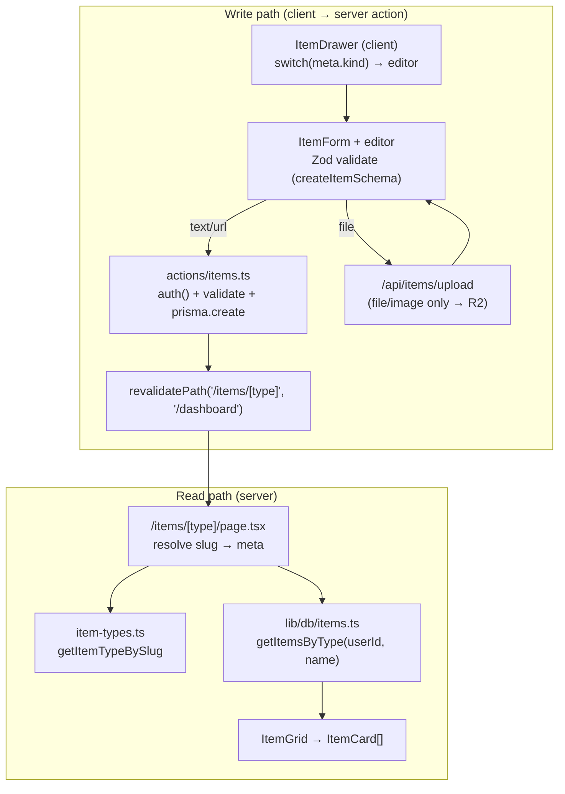

# Item CRUD Architecture

> Design for a unified create / read / update / delete system covering all 7
> system item types (snippet, prompt, note, command, link, file, image) with a
> single set of actions, queries, one dynamic route, and shared components that
> adapt by type.
>
> **This is a design document.** Nothing here is implemented yet — there is no
> `src/actions/` directory and no `/items/[type]` route. It describes the target
> structure and the conventions it must follow, reconciled against the existing
> codebase (`src/lib/db/items.ts`, the dashboard page, the auth API routes) and
> the project's coding standards.

> **Note on the research prompt's sources:** the prompt listed
> `@docs/content-types.md` and `@src/lib/constants.tsx`, neither of which exists.
> The reconciled type reference lives in [`docs/item-types.md`](./item-types.md)
> (the canonical name/icon/color/route/Pro data), and the type metadata is
> currently spread across `prisma/seed.ts`, `ItemTypeIcon.tsx`, and
> `getSidebarItemTypes()` in `src/lib/db/items.ts`. **This design proposes
> finally centralizing that into one module — `src/lib/item-types.ts` — the
> "constants" file the prompt expected.**

---

## Table of Contents

1. [Guiding Principles](#1-guiding-principles)
2. [The Three Content Kinds](#2-the-three-content-kinds)
3. [File Structure](#3-file-structure)
4. [The Type Registry (`src/lib/item-types.ts`)](#4-the-type-registry-srclibitem-typests)
5. [How `/items/[type]` Routing Works](#5-how-itemstype-routing-works)
6. [Mutations — `src/actions/items.ts`](#6-mutations--srcactionsitemsts)
7. [Queries — `src/lib/db/items.ts`](#7-queries--srclibdbitemsts)
8. [Validation — `src/lib/validations/item.ts`](#8-validation--srclibvalidationsitemts)
9. [Components & Their Responsibilities](#9-components--their-responsibilities)
10. [Where Type-Specific Logic Lives](#10-where-type-specific-logic-lives)
11. [End-to-End Data Flow](#11-end-to-end-data-flow)
12. [Open Questions](#12-open-questions)

---

## 1. Guiding Principles

Drawn directly from `context/coding-standards.md` and the existing patterns:

| Principle | Consequence for this design |
| --- | --- |
| **Server Actions for mutations** | All create/update/delete live in `src/actions/items.ts`. API routes are reserved for webhooks, file uploads with progress, and third-party integrations — so the **only** CRUD piece that needs an API route is the Pro file/image upload (progress tracking). |
| **Server components fetch directly with Prisma** | Reads live in `src/lib/db/items.ts` and are called from the `/items/[type]` server component. No client-side data fetching for lists. |
| **Validate all inputs with Zod** | One schema module (`src/lib/validations/item.ts`) with a discriminated union keyed on content kind. |
| **`{ success, data, error }` return pattern** | Every action returns this shape (matches the auth API routes), so client forms branch uniformly and toast errors. |
| **One job per component** | The dynamic route composes small components; type-specific rendering is isolated to editor/preview components, not spread through the page. |
| **Everything scoped by `userId`** | ⚠️ The current dashboard queries are **not** user-scoped (they read all rows — fine for one seed user). Every CRUD query and mutation here **must** filter by the session user and verify ownership before writing. |
| **Type-specific logic in components, not actions** | Actions are generic over `contentType`; the branching by type is a UI concern (which editor, which preview, which fields). See §10. |

---

## 2. The Three Content Kinds

The 7 types collapse into **3 storage shapes** via the `ContentType` enum on
`Item` (see `docs/item-types.md`). This is the single most important fact for the
design: **CRUD is generic over 3 kinds, not 7 types.**

| Content kind | `ContentType` | Types | Primary field(s) | Create surface |
| --- | --- | --- | --- | --- |
| **text** | `TEXT` | snippet, prompt, note, command | `content` (+ optional `language`) | Markdown/code textarea (Server Action) |
| **url** | `URL` | link | `url` | URL input (Server Action) |
| **file** | `FILE` | file, image | `fileUrl`, `fileName`, `fileSize` | Upload API route (Pro) → then Server Action |

Every type also shares: `title`, `description`, `tags`, `isFavorite`,
`isPinned`, `collections`.

---

## 3. File Structure

```
src/
├─ app/
│  └─ items/
│     └─ [type]/
│        ├─ page.tsx              # Server component: resolve slug, fetch, render grid
│        └─ not-found.tsx         # Unknown/Pro-gated type fallback (optional)
│
├─ actions/
│  └─ items.ts                    # 'use server' — ALL mutations for every type
│
├─ lib/
│  ├─ item-types.ts               # NEW: the type registry (constants) — slug↔name,
│  │                              #      content kind, Pro flag, order, metadata
│  ├─ db/
│  │  └─ items.ts                 # EXTEND: add getItemsByType, getItemById (reads)
│  └─ validations/
│     └─ item.ts                  # NEW: Zod schemas (discriminated by content kind)
│
├─ components/
│  └─ items/
│     ├─ ItemsPageHeader.tsx      # Title + count + "New <Type>" button (type-aware)
│     ├─ ItemGrid.tsx             # Grid of ItemCards + empty state
│     ├─ ItemDrawer.tsx           # Create/Edit drawer shell (client); picks editor
│     ├─ ItemForm.tsx             # Shared fields (title, description, tags) + submit
│     ├─ editors/
│     │  ├─ TextEditor.tsx        # content + language  (snippet/prompt/note/command)
│     │  ├─ UrlEditor.tsx         # url field           (link)
│     │  └─ FileUploader.tsx      # upload → fileUrl     (file/image, Pro)
│     ├─ ItemActions.tsx          # Pin / favorite / delete menu (calls actions)
│     └─ ItemViewer.tsx           # Read-only detail view inside the drawer
│
└─ components/dashboard/
   ├─ ItemCard.tsx                # REUSE as-is (already type-driven via color)
   ├─ ItemTypeBadge.tsx           # REUSE
   └─ ItemTypeIcon.tsx            # REUSE (lucide map)
```

**What is new vs. reused:**

- **New:** `app/items/[type]/`, `actions/items.ts`, `lib/item-types.ts`,
  `lib/validations/item.ts`, everything under `components/items/`.
- **Extended:** `lib/db/items.ts` (add per-type list + single-item reads;
  ideally retrofit the existing dashboard queries with `userId` scoping).
- **Reused unchanged:** `ItemCard`, `ItemTypeBadge`, `ItemTypeIcon` — they are
  already data-driven by `{ name, color, icon }` and need no per-type branches.

---

## 4. The Type Registry (`src/lib/item-types.ts`)

The missing "constants" file. Today, `getSidebarItemTypes()` derives label/slug
by pluralizing the DB `name` and derives `isPro` from a hardcoded
`PRO_TYPE_NAMES` set. Centralize all of that so both routing (slug → type) and
the reverse (type → slug/label) have one source of truth.

```ts
// src/lib/item-types.ts
import type { ContentType } from "@/generated/prisma/client";

export type ContentKind = "text" | "url" | "file";

export interface ItemTypeMeta {
  name: string;          // canonical stored name, e.g. "snippet"
  slug: string;          // route slug, e.g. "snippets"
  label: string;         // display label, e.g. "Snippets"
  singular: string;      // "Snippet" — for the "New Snippet" button
  icon: string;          // lucide name (see ItemTypeIcon map)
  color: string;         // hex accent
  kind: ContentKind;     // text | url | file
  contentType: ContentType; // TEXT | URL | FILE
  isPro: boolean;        // file & image
}

// Order matches the overview's item-types table (drives sidebar + any listing).
export const ITEM_TYPES: ItemTypeMeta[] = [ /* snippet … image */ ];

export const ITEM_TYPE_BY_SLUG: Map<string, ItemTypeMeta>;   // "snippets" → meta
export const ITEM_TYPE_BY_NAME: Map<string, ItemTypeMeta>;   // "snippet"  → meta

export function getItemTypeBySlug(slug: string): ItemTypeMeta | undefined;
export function contentKindFor(name: string): ContentKind;
```

**Why a registry and not per-type files:** the 7 types differ only in *metadata*
and *which content kind* they use. A data table keeps the code generic — adding a
custom type later (the planned Pro feature) means appending a row, not writing a
new module. The `color`/`icon` here are the display defaults; the DB `ItemType`
row remains the runtime source (the registry maps slug↔name and supplies the
content-kind + Pro rules the DB doesn't store).

---

## 5. How `/items/[type]` Routing Works

A **single dynamic segment** serves all 7 types. `[type]` is the **plural slug**
(`snippets`, `prompts`, `notes`, `commands`, `links`, `files`, `images`) — the
same slugs the sidebar already links to via `getSidebarItemTypes()`.

```
/items/snippets   → ItemTypeMeta{ name: "snippet", kind: "text", … }
/items/links      → ItemTypeMeta{ name: "link",    kind: "url",  … }
/items/images     → ItemTypeMeta{ name: "image",   kind: "file", isPro: true }
/items/widgets    → notFound()   (unknown slug → 404)
```

**`app/items/[type]/page.tsx` (server component) flow:**

1. `await connection()` — render request-time dynamic, like the dashboard page.
2. Resolve the slug: `const meta = getItemTypeBySlug(params.type)`.
   - Unknown slug → `notFound()`.
3. **Pro gate:** if `meta.isPro` and the user isn't Pro, either `notFound()` or
   render an "Upgrade to Pro" state. (During development all users can access
   everything — gate behind the same flag the free-tier limits use; see the
   overview's "Free-tier enforcement" note.)
4. Fetch the session user (`auth()`), then in parallel:
   `getItemsByType(userId, meta.name)` and the sidebar data the layout needs.
5. Render `ItemsPageHeader` (title = `meta.label`, "New {meta.singular}" button)
   + `ItemGrid` (reusing `ItemCard`).

Because Next.js 16 App Router matches `[type]` for **any** path segment, the
registry's `getItemTypeBySlug` is what actually constrains it to the 7 valid
slugs — there is no `generateStaticParams` needed (the pages are dynamic `ƒ`).

> **Params are async in this Next.js.** Per `AGENTS.md`, read the App Router
> guide in `node_modules/next/dist/docs/` before writing the page — `params` is a
> Promise here (`const { type } = await params`).

---

## 6. Mutations — `src/actions/items.ts`

**One file, `'use server'`, all types.** The actions are **generic over content
kind** — they never contain `if (type === "snippet")` branches. Type-specific
input shaping happens in the *component* that calls the action (§10); the action
just validates the already-shaped payload and writes it.

```ts
"use server";

export async function createItem(input: CreateItemInput): Promise<ActionResult<{ id: string }>>;
export async function updateItem(id: string, input: UpdateItemInput): Promise<ActionResult<{ id: string }>>;
export async function deleteItem(id: string): Promise<ActionResult>;

// Small, frequent toggles — their own thin actions so cards can call them directly:
export async function togglePin(id: string): Promise<ActionResult<{ isPinned: boolean }>>;
export async function toggleFavorite(id: string): Promise<ActionResult<{ isFavorite: boolean }>>;

// Collection membership (an item can be in many collections):
export async function setItemCollections(id: string, collectionIds: string[]): Promise<ActionResult>;
```

Where `ActionResult<T>` is the project's established shape:

```ts
type ActionResult<T = undefined> =
  | { success: true; data?: T }
  | { success: false; error: string; code?: string; issues?: Record<string, string[]> };
```

**Every mutation follows the same skeleton** (mirroring the auth routes):

```ts
export async function createItem(input: CreateItemInput) {
  const session = await auth();
  if (!session?.user?.id) return { success: false, error: "You must be signed in." };

  const parsed = createItemSchema.safeParse(input);          // Zod, discriminated by kind
  if (!parsed.success) return { success: false, error: "Validation failed", issues: … };

  // Pro gate for file/image kinds; free-tier item-count limit check (behind flag).

  try {
    const item = await prisma.item.create({
      data: {
        userId: session.user.id,
        itemTypeId: parsed.data.itemTypeId,
        contentType: parsed.data.contentType,               // TEXT | URL | FILE
        title: parsed.data.title,
        // only the fields for this kind are set; the rest stay null
        content:  parsed.data.kind === "text" ? parsed.data.content  : null,
        language: parsed.data.kind === "text" ? parsed.data.language : null,
        url:      parsed.data.kind === "url"  ? parsed.data.url       : null,
        fileUrl:  parsed.data.kind === "file" ? parsed.data.fileUrl   : null,
        // tags via connectOrCreate; collections via nested ItemCollection create
      },
    });
    revalidatePath(`/items/${slugForType(...)}`);
    revalidatePath("/dashboard");
    return { success: true, data: { id: item.id } };
  } catch (e) {
    console.error("createItem failed:", e);
    return { success: false, error: "Something went wrong. Please try again." };
  }
}
```

**Ownership on update/delete:** never trust the id alone. Scope the write to the
owner so a user can't mutate another user's item:

```ts
const result = await prisma.item.updateMany({ where: { id, userId: session.user.id }, data });
if (result.count === 0) return { success: false, error: "Not found" };  // or 404-equivalent
```

**Tags:** reuse the seed's `connectOrCreate` approach against the globally-unique
`Tag.name`. **Cache:** call `revalidatePath` for the affected `/items/[type]`
page and `/dashboard` after each successful write.

**The file/image exception:** `fileUrl` comes from Cloudflare R2. Uploading with
progress is exactly the case coding-standards routes to an **API route**, not a
Server Action. So the flow is: client uploads the binary to
`POST /api/items/upload` (streams to R2, returns `{ fileUrl, fileName, fileSize }`),
then calls `createItem`/`updateItem` with those values. The action itself stays
pure DB work.

---

## 7. Queries — `src/lib/db/items.ts`

Extend the existing file (which already has `toDashboardItem`, `itemSelect`,
`relativeTime`, and the dashboard queries). Add:

```ts
/** All of a user's items of one type, newest first, for /items/[type]. */
export async function getItemsByType(userId: string, typeName: string): Promise<DashboardItem[]>;

/** A single item with everything the drawer/editor needs (owner-scoped). */
export async function getItemById(userId: string, id: string): Promise<ItemDetail | null>;
```

- `getItemsByType` reuses `itemSelect` + `toDashboardItem`, adding
  `where: { userId, itemType: { name: typeName } }, orderBy: { updatedAt: "desc" }`.
- `getItemById` selects the full editable field set (`content`, `language`,
  `url`, `fileUrl`, `fileName`, `fileSize`, `tags`, `collections`) — a richer
  `ItemDetail` shape than the card's `DashboardItem`.
- **Retrofit note:** the existing `getPinnedItems`/`getRecentItems`/`getItemStats`
  should gain the same `where: { userId }` scoping when auth-scoped browsing lands
  (currently global — correct only because there is one seed user).

Reads stay in `lib/db` and are called **directly from the server component** —
never from a client component or an action.

---

## 8. Validation — `src/lib/validations/item.ts`

A **discriminated union on content kind** keeps one schema covering all types
while making each kind's required fields explicit (mirrors `validations/auth.ts`):

```ts
import { z } from "zod";

const baseFields = {
  title: z.string().trim().min(1, "Title is required").max(200),
  description: z.string().trim().max(2000).optional(),
  itemTypeId: z.string().min(1),
  tags: z.array(z.string().trim().min(1)).max(20).default([]),
  collectionIds: z.array(z.string()).default([]),
};

const textItem = z.object({ kind: z.literal("text"), contentType: z.literal("TEXT"),
  content: z.string().min(1, "Content is required"), language: z.string().optional(), ...baseFields });

const urlItem  = z.object({ kind: z.literal("url"),  contentType: z.literal("URL"),
  url: z.string().url("Enter a valid URL"), ...baseFields });

const fileItem = z.object({ kind: z.literal("file"), contentType: z.literal("FILE"),
  fileUrl: z.string().url(), fileName: z.string(), fileSize: z.number().int().positive(), ...baseFields });

export const createItemSchema = z.discriminatedUnion("kind", [textItem, urlItem, fileItem]);
export const updateItemSchema = /* same union, all fields partial except identity */;

export type CreateItemInput = z.infer<typeof createItemSchema>;
export type UpdateItemInput = z.infer<typeof updateItemSchema>;
```

The same schema validates on the **client** (inline field errors in the form)
and on the **server** (inside the action) — the single source of truth for what a
valid item of each kind looks like.

---

## 9. Components & Their Responsibilities

| Component | Client/Server | Responsibility | Type-awareness |
| --- | --- | --- | --- |
| `app/items/[type]/page.tsx` | Server | Resolve slug → type, Pro-gate, fetch items, compose header + grid | Reads `meta` once; passes it down |
| `ItemsPageHeader` | Server | Page title (`meta.label`), item count, "New {singular}" button | Label/singular from `meta` |
| `ItemGrid` | Server | Lay out `ItemCard`s; empty state ("No snippets yet") | None — generic list |
| `ItemCard` *(reused)* | Server | One item card: type-colored border, preview, tags, time | Driven by `itemType.color` — already generic |
| `ItemDrawer` | Client | Slide-over shell for create/edit; **selects which editor** by `kind` | **The one place kind is switched** |
| `ItemForm` | Client | Shared fields (title, description, tags, collections) + submit → action | None |
| `editors/TextEditor` | Client | `content` + optional `language` (markdown/code) | text kind only |
| `editors/UrlEditor` | Client | `url` input with validation | url kind only |
| `editors/FileUploader` | Client | Upload to R2 API route, surface progress, set `fileUrl` | file kind only (Pro) |
| `ItemActions` | Client | Pin / favorite / delete menu → `togglePin`/`toggleFavorite`/`deleteItem` | None |
| `ItemViewer` | Client | Read-only detail (syntax highlight for text, preview for link/image) | Renders by kind |

The **drawer** (per the overview's UI spec — items "open in a quick-access
drawer") is the create/edit/view surface. It renders `ItemForm` (shared fields)
plus exactly one `editors/*` component chosen from `meta.kind`.

---

## 10. Where Type-Specific Logic Lives

**Rule: type-specific logic lives in components (and the registry), never in
actions or queries.**

- **Actions** (`src/actions/items.ts`) are generic over the 3 content kinds. They
  receive an already-validated, already-shaped payload and write it. The only
  "kind" awareness is mapping kind → which columns are non-null, driven by the
  validated discriminated union — data, not control flow per type.
- **Queries** (`src/lib/db/items.ts`) are generic: `getItemsByType` takes a type
  name; `itemPreview()` already switches on `contentType` in one small helper.
- **The registry** (`src/lib/item-types.ts`) holds the *data* that differs per
  type (slug, label, color, icon, kind, Pro) — a table, not branching code.
- **Components** hold the genuinely divergent *UI*:
  - `ItemDrawer` switches on `meta.kind` to mount `TextEditor` / `UrlEditor` /
    `FileUploader` — **the single `switch (kind)` in the whole system.**
  - `ItemViewer` renders differently per kind (code highlight vs. link preview
    vs. image thumbnail).

This keeps the write path uniform and testable while letting the parts that
*must* differ (input widgets, preview rendering) stay small and isolated. Adding
a custom type later is: append a registry row + (if it needs a new input widget)
one editor component — no changes to actions or queries.

---

## 11. End-to-End Data Flow



- **Read:** server component → registry (slug→type) → `lib/db` → cards. No client
  fetching.
- **Write:** client drawer/form → Zod → Server Action (`auth` + ownership +
  `prisma`) → `revalidatePath` re-renders the page. File kinds detour through the
  upload API route first to obtain `fileUrl`.

---

## 12. Open Questions

- **User scoping retrofit.** The existing dashboard queries read all rows. Decide
  whether to scope them by `userId` as part of this work or in a dedicated pass —
  CRUD *must* scope; the dashboard should match to avoid cross-user leakage once
  there's more than the seed user.
- **Pro gate vs. free-tier flag.** File/image routes and the item-count limit
  (50 items free) should sit behind the same feature flag the overview describes
  ("build the limit checks now behind a flag"). Where does that flag live —
  extend `src/lib/features.ts`?
- **Drawer routing.** Is the drawer a URL-addressable state
  (`/items/snippets?item=<id>` or an intercepting route) or pure client state?
  The overview says "quick-access drawer"; intercepting routes give shareable
  URLs but add complexity.
- **Registry vs. DB drift.** `item-types.ts` duplicates `color`/`icon` that also
  live on the `ItemType` DB row. Treat the DB as runtime truth and the registry
  as the slug/kind/Pro map, or seed the DB *from* the registry to guarantee they
  agree.
- **Tag scoping.** Tags are globally unique today. If tags become per-user (an
  open question in the overview), `connectOrCreate` in the actions changes to key
  on `(name, userId)`.
```
